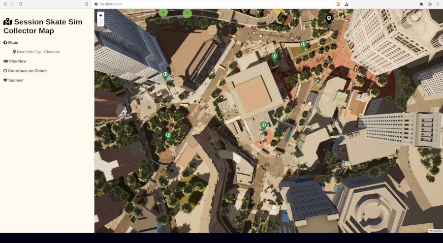

# Session Skate Sim Collector Map

A project inspired by https://github.com/jeanropke/RDR2CollectorsMap.

It is a community-created Fan map with locations of the game features, spots, and so on inner Session Skate Sim world.

## POC

- [x] Picture from NYC Brooklin, Chatham map(1920*1080)  
- [x] Test adding some markers
  - [x] Historical challenge marker type
  - [x] Daily Challenge marker type
- [x] Some styling
- [ ] Show/Hide markers from a type
- [ ] Check if there are Copyright issues? (I'm new in the gaming world XD)

[Live Demo](https://kpicaza.github.io/scm/)

## MVP (help welcome)

- [ ] HD Picture from NYC Booklin, Chatham map  
- [ ] Historical challenge marker type
- [ ] Historical challenge marker content
- [ ] Daily Challenge marker type
- [ ] Daily Challenge marker content
- [ ] Mission marker type
- [ ] Mission marker content
- [ ] Bus Stop marker type
- [ ] Bus Stop marker content
- [ ] Skateshop marker type
- [ ] Skateshop marker content
- [ ] Define initial Look & Feel

## Contributing

Every contribution will be welcome and well attributed. It is a community-made non-profit project based on Session Skate Sim Game and community content around the game.

- Content contributions: This project is content-based. Any medium or info will be welcome. It is not required to be a programmer or have any web development skills.
  * [New Pointer](https://github.com/kpicaza/scm/issues/new?assignees=kpicaza&labels=content&template=submit-pointer.yml&title=%5BNew+Pointer%5D%3A+)
- Bug Report: Open an issue using the [bug template](https://github.com/kpicaza/scm/issues/new?assignees=kpicaza&labels=bug%2Ctriage&template=bug.yml&title=%5BBug%5D%3A+).
- Feature Request: Open [new discussion](https://github.com/kpicaza/scm/discussions).
- Code contributions: You are free to open Pull requests. We will be glad to review and merge them.
- Donations: If you want to economically support our work, you can make donations via the Github Sponsors feature.
