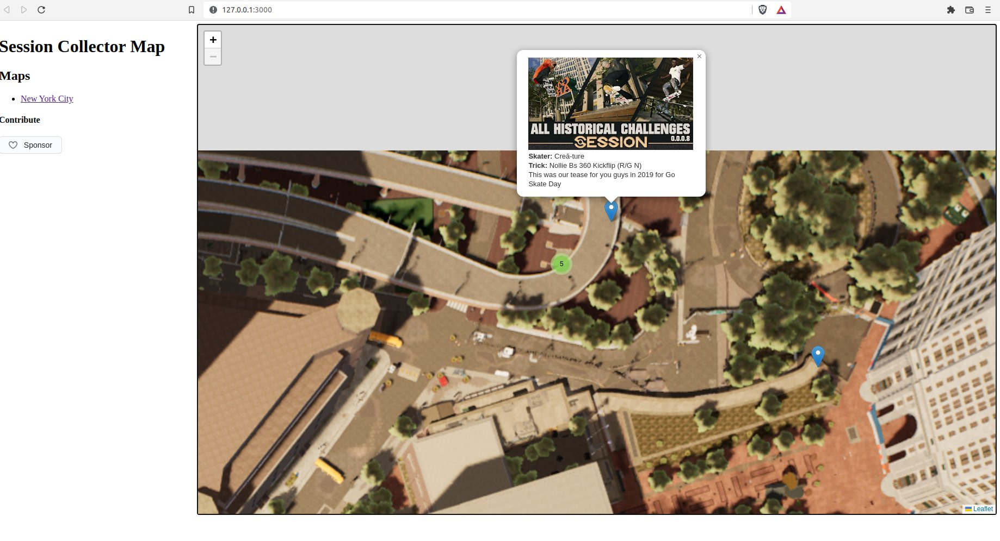

# Session Skate Sim Collector Map

This project is inspired by https://github.com/jeanropke/RDR2CollectorsMap.

## POC

- [x] Piture from NYC Booklin, Chatham map(1920*1080)  
- [x] Test adding some markers
    - [ ] Historical challenge marker type
    - [ ] Daily Challenge marker type   
- [ ] Check if there are Copyright issues? (I'm new in the geming world XD)

## MVP

- [ ] HD Picture from NYC Booklin, Chatham map  
- [ ] Historical challenge marker type
- [ ] Historical challenge marker content
- [ ] Daily Challenge marker type   
- [ ] Daily Challenge marker content   
- [ ] Define initial Look & Feel

## Contributing

Every contribution will be welcome and well attributed. This is a community made non-profit project, based on Session Skate Sim Game and community content around the game. 

* Code contributions: 
* Content contributions: 
* Domations: If you want to economicaly support our work you can make donations via github Sponsors feature 
