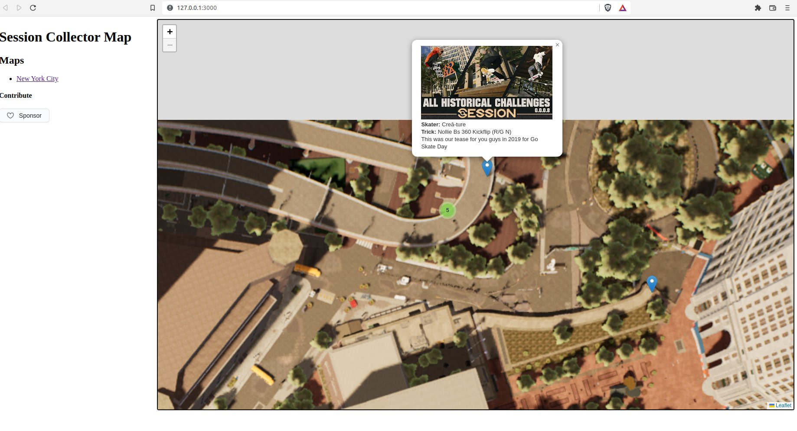

# Session Skate Sim Collector Map

This project is inspired by https://github.com/jeanropke/RDR2CollectorsMap.

A community created Fan map with locations of the especial features, spots and so on inner Session Skate Sim wold.

## POC

- [x] Picture from NYC Booklin, Chatham map(1920*1080)  
- [x] Test adding some markers
    - [x] Historical challenge marker type
    - [ ] Daily Challenge marker type   
- [ ] Check if there are Copyright issues? (I'm new in the geming world XD)

## MVP

- [ ] HD Picture from NYC Booklin, Chatham map  
- [ ] Historical challenge marker type
- [ ] Historical challenge marker content
- [ ] Daily Challenge marker type   
- [ ] Daily Challenge marker content   
- [ ] Define initial Look & Feel

## Contributing

Every contribution will be welcome and well attributed. This is a community made non-profit project, based on Session Skate Sim Game and community content around the game. 

* Content contributions: This project is a content based project, any medium or info will be welcome, it not required to be a programmer or to have any web development skills. 
* Bug Report: Open an issue using the [bug template](https://github.com/kpicaza/scm/issues/new?assignees=kpicaza&labels=bug%2Ctriage&template=bug.yml&title=%5BBug%5D%3A+)
* Feature Request: Open [new discussion](https://github.com/kpicaza/scm/discussions) 
* Code contributions: You are free to open Pull requests, we will be glad to review and merge them.
* Domations: If you want to economicaly support our work you can make donations via github Sponsors feature 

